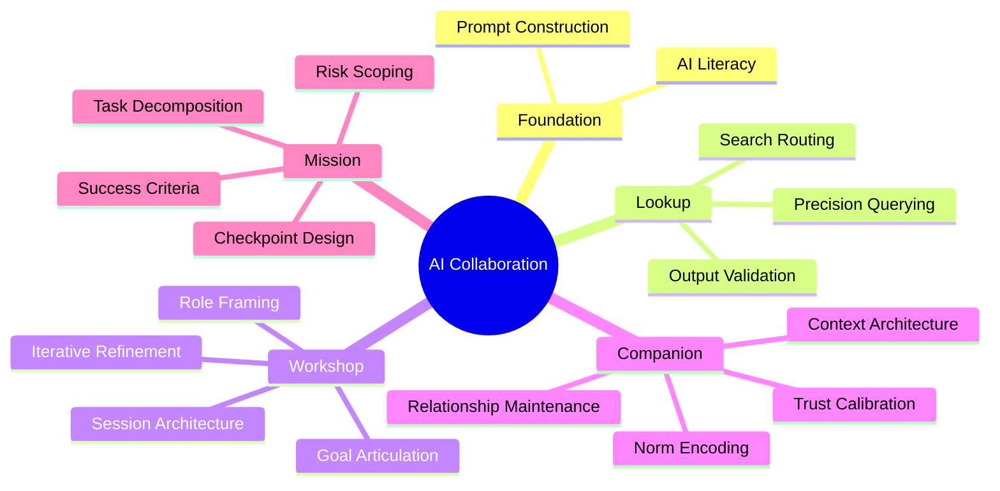

Previous posts established the [four collaboration patterns](/posts/four-modes-of-ai-collaboration/) and mapped [how organizations onboard agent colleagues by team and career level](/posts/structuring-collaboration/). What's still missing is the individual's instrument: a map of where you are, what's locked, and what to unlock next.

RPG players know the skill tree. You don't max everything at once—you pick a path, invest points, unlock gates, and specialize. The design encodes prerequisites. You can't cast fireball until you've mastered spark. The tree tells you what to learn, in what order, and what becomes possible as you develop. AI adoption needs the same structure.

## The Tree

## Reading the Tree

**Foundation** is the prerequisite for everything else. **AI Literacy** means knowing how language models actually work—not the math, but the failure modes: what hallucination looks like, where the model is confident versus where it's extrapolating, why prompt structure matters. **Prompt Construction** is the companion skill: translating that understanding into queries that actually get you what you need.

**Lookup** is the first pattern. **Precision Querying** is the core skill: scoping a question so completely that a single exchange gets you what you need. **Output Validation** follows—evaluating the response critically, not just accepting it. **Search Routing** is the advanced Lookup skill: knowing which model or tool fits which type of query. This sounds obvious until you're routing everything through your most expensive option by default.

**Workshop** requires a different kind of articulation. **Goal Articulation**—describing what "done" looks like without specifying every step—is the unlock. Without it, you're still in Lookup mode regardless of how long the session runs. From there: **Iterative Refinement** (steering through multiple rounds without losing direction), **Role Framing** (positioning the agent appropriately for the task: reviewer, implementer, adversarial critic), and **Session Architecture** (structuring a complex collaborative session deliberately rather than letting it drift).

**Companion** requires the Workshop skills around framing and structure, not just iteration. The core Companion skill is **Context Architecture**: building persistent context that works—CLAUDE.md files, system prompts, knowledge libraries that an agent inherits. **Trust Calibration** is where most people underinvest: genuinely mapping where an agent colleague is reliable and where they aren't, and adjusting accordingly. **Norm Encoding** follows: translating team standards into reusable agent instructions. **Relationship Maintenance** keeps the accumulated context accurate as things change.

**Mission** requires Trust Calibration and Relationship Maintenance from the Companion branch. You can't safely delegate autonomously until you know where the agent will make good judgments. **Task Decomposition** means breaking complex goals into well-scoped autonomous sub-tasks. **Success Criteria** means specifying what "done" looks like precisely enough for autonomous execution. **Checkpoint Design** means knowing when to interrupt versus when to let the agent run. **Risk Scoping** closes the loop: pre-scoping the agent's authority before you send it off, not after it does something you didn't intend.

## The Pattern in the Tree

The tree encodes an insight that isn't obvious until you draw it: as you progress, the level of abstraction at which you engage rises.

In Lookup, you specify everything. In Workshop, you specify a goal. In Companion, accumulated context fills in gaps you no longer need to articulate. In Mission, you operate at the level of intent.

This is why you can't skip levels. It isn't bureaucracy. Each pattern requires genuinely mastering the abstraction of the one before. Someone who skips Companion and goes straight to Mission is typically someone who hasn't calibrated trust—they don't know where to set checkpoints because they've never mapped where the agent is reliable. They don't get Mission outcomes; they get Mission-shaped chaos.

## How Organizations Use This

The skill tree is a shared language for assessing where individuals are and designing what comes next. Applied at the team level:

**Assess honestly.** Where are people, actually? Most teams are heavy on Lookup with some Workshop, and sparse beyond that. The distribution matters more than the average.

**Find the bottleneck.** It's usually Goal Articulation. People who haven't learned to specify "done" without specifying every step can't get into Workshop mode effectively—regardless of how capable the underlying model is.

**Design progressions, not events.** The tree tells you what to teach first. Foundation before Lookup. Output Validation before Goal Articulation. Session Architecture before Context Architecture. One-day AI workshops that skip the prerequisites don't build skills; they build confusion.

**Track capability, not tooling.** [Which tools people use is secondary.](/posts/dont-fall-in-love-with-your-tools/) Which nodes in the tree they can reliably execute is what determines what's possible.

---

One thing the tree doesn't show: the org-level skills that run alongside individual progression. Standards Curation, Adoption Coaching, Infrastructure Design—these live at the team and architect level, and they're what make individual skill development compound across an organization rather than staying local. That's a separate tree, and a future post.

---

*Part of a series on AI adoption. See also: [Four Modes of AI Collaboration](/posts/four-modes-of-ai-collaboration/) and [Structuring Collaboration: AI Adoption as Agentic Onboarding](/posts/structuring-collaboration/).*

*Written in collaboration with Claude, implementing the Workshop pattern described above.*
