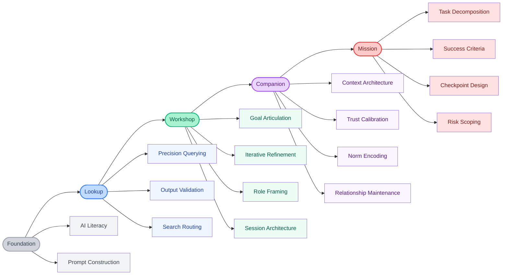

Previous posts established the [four collaboration patterns](/posts/four-modes-of-ai-collaboration/) and mapped [how organizations onboard agent colleagues](/posts/structuring-collaboration/). What's missing is the individual's instrument: a map of where you are, what's locked, what to unlock next.

RPG players know the skill tree. You pick a path, invest points, unlock gates, specialize. Prerequisites are encoded—no fireball until you've mastered spark. The tree tells you what to learn, in what order, and what becomes possible. AI adoption needs the same structure.

## The Tree

## Reading the Tree

**Foundation** is the prerequisite for everything else. **AI Literacy** means knowing how language models actually work—not the math, but the failure modes: what hallucination looks like, where the model is confident versus extrapolating, why prompt structure matters. **Prompt Construction** translates that understanding into queries that get what you need.

**Lookup** is the first pattern. **Precision Querying**: scoping a question completely enough that one exchange suffices. **Output Validation** follows—evaluating responses critically, not just accepting them. **Search Routing**: matching model or tool to query type. Sounds obvious until you're routing everything through your most expensive option by default.

**Workshop** requires a different articulation. **Goal Articulation**—describing "done" without specifying every step—is the unlock. Without it, you're still in Lookup regardless of session length. Then: **Iterative Refinement** (steering through rounds without losing direction), **Role Framing** (positioning the agent: reviewer, implementer, adversarial critic), and **Session Architecture** (structuring complex sessions deliberately rather than letting them drift).

**Companion** needs Workshop's framing and structure, not just iteration. **Context Architecture** is core: persistent context that works—CLAUDE.md files, system prompts, knowledge libraries an agent inherits. **Trust Calibration** is where most underinvest: mapping where the agent is reliable and where it isn't, then adjusting. **Norm Encoding** follows: team standards as reusable agent instructions. **Relationship Maintenance** keeps accumulated context accurate as things change.

**Mission** requires Trust Calibration and Relationship Maintenance. You can't safely delegate autonomously until you know where the agent makes good judgments. **Task Decomposition**: breaking complex goals into well-scoped autonomous sub-tasks. **Success Criteria**: specifying "done" precisely enough for autonomous execution. **Checkpoint Design**: knowing when to interrupt versus let the agent run. **Risk Scoping** closes the loop—pre-scoping the agent's authority before sending it off, not after something unintended.

## The Pattern in the Tree

The tree encodes an insight that isn't obvious until you draw it: as you progress, the level of abstraction rises.

In Lookup, you specify everything. In Workshop, a goal. In Companion, accumulated context fills the gaps. In Mission, you operate at the level of intent.

That's why you can't skip levels—it isn't bureaucracy. Each pattern requires mastering the abstraction of the one before. Skip Companion for Mission and you typically haven't calibrated trust: you don't know where to set checkpoints because you've never mapped where the agent is reliable. You don't get Mission outcomes; you get Mission-shaped chaos.

## How Organizations Use This

The tree is shared language for assessing where individuals are and designing what's next. At team level:

**Assess honestly.** Where are people, actually? Most teams are heavy on Lookup, some Workshop, sparse beyond. The distribution matters more than the average.

**Find the bottleneck.** Usually Goal Articulation. People who can't specify "done" without specifying every step never get into Workshop, regardless of model capability.

**Design progressions, not events.** The tree tells you what to teach first: Foundation before Lookup, Output Validation before Goal Articulation, Session Architecture before Context Architecture. One-day workshops that skip prerequisites don't build skills; they build confusion.

**Track capability, not tooling.** [Which tools people use is secondary.](/posts/dont-fall-in-love-with-your-tools/) Which nodes they can reliably execute determines what's possible.

---

One thing the tree doesn't show: the org-level skills running alongside individual progression. Standards Curation, Adoption Coaching, Infrastructure Design live at the team and architect level. They're what makes individual skill development compound across an organization rather than staying local. A separate tree, a future post.

---

*Part of a series on AI adoption. See also: [Four Modes of AI Collaboration](/posts/four-modes-of-ai-collaboration/) and [Structuring Collaboration: AI Adoption as Agentic Onboarding](/posts/structuring-collaboration/).*

*Written in collaboration with Claude, implementing the Workshop pattern described above.*
